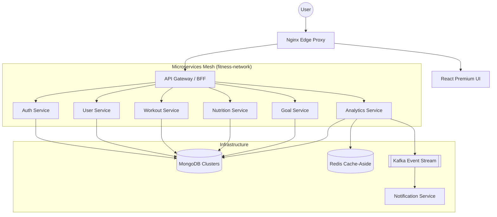

# 🏋️‍♂️ MERN Fitness Tracker: Elite Edition

A production-grade, microservices-based fitness and wellness platform engineered for scalability, reliability, and high performance. Features a premium "Identity Protocol" UI design for high-fidelity user experiences.

[](./docker-compose.yml)
[](./infra/kubernetes)
[](LICENSE)

## 📖 Overview
The **MERN Fitness Tracker** is a comprehensive cloud-native ecosystem that enables users to manage their health journey through data-driven insights. Built with a modular microservices architecture, it handles everything from workout logging and nutrition tracking to advanced progress analytics via a premium, responsive React interface.

---

## 🏗️ System Architecture

The platform follows a **Backend-for-Frontend (BFF)** pattern with an API Gateway, Nginx edge proxy, and a highly decoupled microservices mesh.



---

## 🛠️ Technology Stack & Optimizations

| Layer | Technologies & Optimizations |
| :--- | :--- |
| **Frontend** | React 18, Tailwind CSS, Lucide Icons, Framer Motion. Features "Identity Protocol" light-mode aesthetics. |
| **Edge & Proxy** | **Nginx**: Configured with Gzip compression, strict CSP/XSS headers, and static asset edge-caching. |
| **Microservices** | Node.js, Express. Fully path-stripped API Gateway integration. |
| **Database** | **MongoDB**: Advanced Mongoose usage including Compound Indexes, Virtuals, and TTL Indexes for auto-pruning. |
| **Caching** | **Redis (ioredis)**: Cache-Aside pattern applied to expensive analytics queries for sub-millisecond response times. |
| **Infra** | Docker Compose with isolated bridge networking (`fitness-network`) and deterministic startup sequencing. |

---

## 🚀 Getting Started

### Prerequisites
- [Docker Desktop](https://www.docker.com/products/docker-desktop/)
- [Node.js 18+](https://nodejs.org/)

### Quick Start (Local Development)
1. **Clone the repository**
2. **Launch the entire stack**:
   ```bash
   docker compose up -d --build
   ```
3. **Access the platform**:
   - **Frontend UI**: [http://localhost](http://localhost) (via Nginx)
   - **API Gateway**: [http://localhost/api](http://localhost/api)

---

## 🧩 Microservices Directory: Why & How

The platform is decomposed into specific, bounded contexts. This allows teams to scale and deploy features independently. 

### 1. API Gateway & Edge Proxy
- **Why**: Exposing raw microservices to the public internet is a massive security risk and creates nightmare client-side routing.
- **How**: **Nginx** acts as the impenetrable front door (handling Gzip, CSP, XSS protection, and static routing on port `80`). It routes API traffic to the **API Gateway** (Node.js/`http-proxy-middleware`), which dynamically resolves internal service IPs and strips prefixes before forwarding requests to the internal `fitness-network`.

### 2. Auth Service (`/services/auth-service`)
- **Why**: Centralizing authentication prevents credential leaks and standardizes security logic across the entire platform.
- **How**: It connects to `auth_db` to manage credentials. It intercepts `POST /register` and `POST /login`, validates passwords via bcrypt, and issues signed JSON Web Tokens (JWTs) that other services use to verify user identity.

### 3. User Service (`/services/user-service`)
- **Why**: Separating identity (Auth) from profile data (User) keeps the Auth service ultra-light and fast, while the User service handles heavy social/preference data.
- **How**: Connects to `user_db`. Handles `GET /profile/:username` and `PUT /preferences`. It stores complex JSON structures for theme settings and follower counts, which the frontend uses to personalize the dashboard.

### 4. Workout Service (`/services/workout-service`)
- **Why**: Workout data scales massively (thousands of logs per user). Isolating it ensures high write-throughput doesn't impact other services.
- **How**: Connects to `workout_db`. Provides `GET /plans` for static training regimens and `POST /log` to append new sessions. The frontend hits this to populate the "Recent Pulse" activity feed.

### 5. Nutrition Service (`/services/nutrition-service`)
- **Why**: Calculating macronutrients and caloric deficits requires different logic and scaling requirements than logging squats.
- **How**: Connects to `nutrition_db`. Provides `POST /meals` and `GET /today`. It uses array reduction to automatically aggregate daily Protein, Carbs, Fats, and Calories, passing the summary back to the UI.

### 6. Goal Service (`/services/goal-service`)
- **Why**: Tracking long-term milestones (e.g., Marathon Training) and daily habits requires background chron-jobs and streak calculations.
- **How**: Connects to `goal_db`. Implements advanced Mongoose Schemas with Virtuals (`GoalSchema.virtual('progress')`) to automatically calculate completion percentages on the fly when `GET /` or `PATCH /habits/:id/increment` is called.

### 7. Analytics Service (`/services/analytics-service`)
- **Why**: Generating weekly performance charts across all modules is computationally expensive. Running this on the Workout or Goal service would crash them.
- **How**: Connects to `analytics_db` and **Redis**. It acts as a data aggregator. To protect the database from expensive queries, it uses a **Cache-Aside Pattern**. `GET /reports/weekly/:userId` checks Redis first; if missing, it runs the heavy DB query, saves the result to Redis with a 1-hour TTL, and returns the data.

### 8. Notification Service (`/services/notification-service`)
- **Why**: Sending emails or push notifications is a slow network operation. Waiting for an email to send during an API request causes terrible UX.
- **How**: It uses **Apache Kafka** for asynchronous, event-driven architecture. When a user hits a milestone, the Goal service fires an event to Kafka. The Notification service (acting as a consumer) reads the event at its own pace and dispatches the email, ensuring the main API never blocks.

---

## 🛠️ API Usage Examples

### Fetch Weekly Analytics Report
This endpoint demonstrates the Redis Cache-Aside pattern. The first call generates the report via MongoDB; subsequent calls within 1 hour are served directly from Redis.

**Endpoint:** `GET /api/analytics/reports/weekly/user_123`

**Example Request:**
```bash
curl -X GET http://localhost/api/analytics/reports/weekly/user_123
```

**Example Response:**
```json
{
  "userId": "user_123",
  "period": "2026-W18",
  "data": {
    "totalWorkouts": 5,
    "totalCalories": 3200,
    "avgHeartRate": 72
  },
  "source": "cache" 
}
```

---

## 🌟 Core Features

- ✅ **High-Fidelity Dashboard**: "Neural Progress Map" and real-time pulse tracking.
- 💳 **Subscription Module**: Interactive pricing tiers (Free Core, Pro Intel, Elite Entity).
- 🥗 **Nutrition Intelligence**: Automated macro breakdown aggregation.
- 📊 **High-Performance Caching**: Redis integration drastically reduces API latency.
- 🎯 **Advanced Mongoose Schemas**: Real-time progress virtuals and strict data validation.
- 🔒 **Edge Security**: Nginx reverse proxy shields internal microservices.

---

## 🌐 Live Deployment Status

Verify the health of all services using the API Gateway:

| Service | Health Check Link | Status |
| :--- | :--- | :--- |
| **API Gateway** | [http://localhost/api/health](http://localhost/api/health) |  |
| **Auth Service** | [http://localhost/api/auth/health](http://localhost/api/auth/health) |  |
| **User Service** | [http://localhost/api/users/health](http://localhost/api/users/health) |  |
| **Workout Service**| [http://localhost/api/workouts/health](http://localhost/api/workouts/health) |  |
| **Nutrition Service**| [http://localhost/api/nutrition/health](http://localhost/api/nutrition/health) |  |
| **Goal Service** | [http://localhost/api/goals/health](http://localhost/api/goals/health) |  |
| **Analytics Service**| [http://localhost/api/analytics/health](http://localhost/api/analytics/health) |  |
| **Notification Service**| [http://localhost/api/notifications/health](http://localhost/api/notifications/health) |  |

---

*Built with ❤️ by the Engineering Team.*
